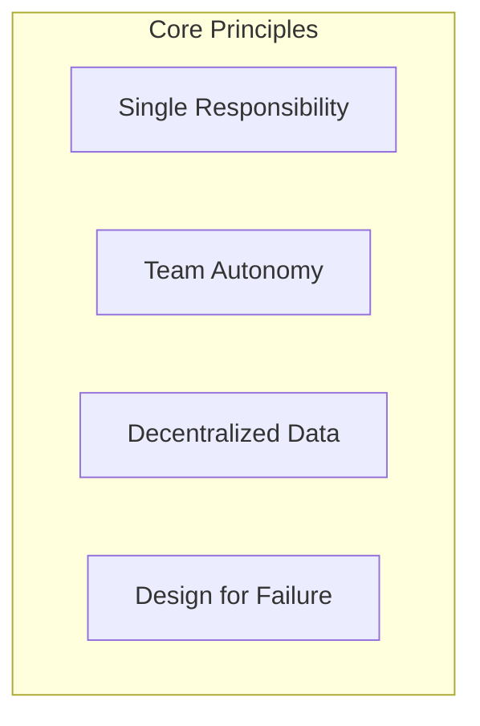
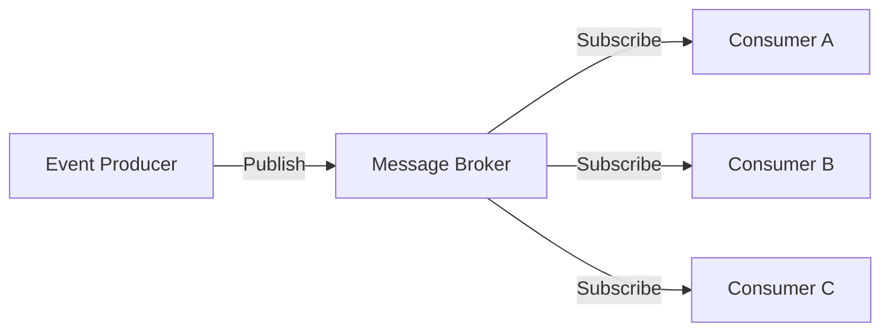
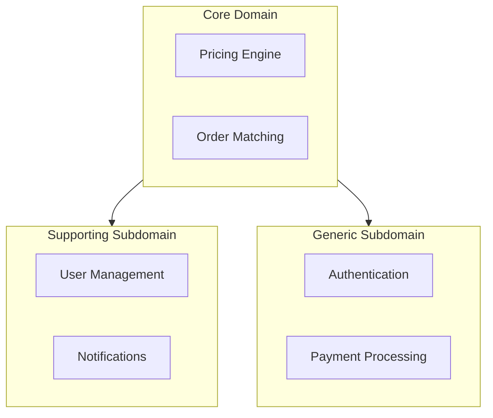

# Architecture Patterns Reference

Comprehensive guide to modern architecture patterns for scalable systems.

---

## Table of Contents

1. [Microservices Architecture](#microservices-architecture)
2. [Event-Driven Architecture](#event-driven-architecture)
3. [Hexagonal Architecture](#hexagonal-architecture)
4. [Domain-Driven Design (DDD)](#domain-driven-design)
5. [CQRS & Event Sourcing](#cqrs--event-sourcing)
6. [Anti-Patterns to Avoid](#anti-patterns-to-avoid)

---

## Microservices Architecture

### When to Use
- Team size > 10 engineers
- Multiple deployment frequencies needed
- Different scaling requirements per component
- Technology diversity required

### Key Principles



### Service Boundaries

| Bounded Context | Service | Database | Team |
|----------------|---------|----------|------|
| User Management | user-service | PostgreSQL | Platform |
| Orders | order-service | PostgreSQL | Commerce |
| Payments | payment-service | PostgreSQL | Payments |
| Notifications | notify-service | Redis | Platform |

### Communication Patterns

```typescript
// Synchronous - REST/gRPC
interface UserService {
  getUser(id: string): Promise<User>;
  createUser(data: CreateUserDTO): Promise<User>;
}

// Asynchronous - Events
interface OrderEvents {
  'order.created': { orderId: string; userId: string; total: number };
  'order.completed': { orderId: string; completedAt: Date };
  'order.cancelled': { orderId: string; reason: string };
}
```

### Best Practices

1. **API Gateway Pattern** - Single entry point for clients
2. **Service Registry** - Dynamic service discovery
3. **Circuit Breaker** - Prevent cascade failures
4. **Saga Pattern** - Distributed transactions

---

## Event-Driven Architecture

### Core Components



### Event Schema Design

```typescript
// Base event structure
interface DomainEvent<T = unknown> {
  eventId: string;
  eventType: string;
  aggregateId: string;
  aggregateType: string;
  timestamp: Date;
  version: number;
  payload: T;
  metadata: {
    correlationId: string;
    causationId: string;
    userId?: string;
  };
}

// Example event
interface OrderCreatedEvent extends DomainEvent<{
  items: Array<{ productId: string; quantity: number; price: number }>;
  shippingAddress: Address;
  total: number;
}> {
  eventType: 'order.created';
  aggregateType: 'Order';
}
```

### Message Broker Selection

| Broker | Use Case | Throughput | Ordering |
|--------|----------|------------|----------|
| **Kafka** | High-volume, replay needed | Very High | Partition-level |
| **RabbitMQ** | Complex routing, low latency | High | Queue-level |
| **SQS** | AWS native, simple queuing | High | FIFO optional |
| **Redis Streams** | Real-time, in-memory | Very High | Stream-level |

### Best Practices

1. **Idempotent Consumers** - Handle duplicate events gracefully
2. **Event Versioning** - Plan for schema evolution
3. **Dead Letter Queues** - Handle failed events
4. **Event Replay** - Support historical reconstruction

---

## Hexagonal Architecture

Also known as **Ports and Adapters**.

### Structure

```
src/
├── domain/                 # Core business logic (no dependencies)
│   ├── entities/
│   ├── value-objects/
│   ├── services/
│   └── events/
├── application/            # Use cases & orchestration
│   ├── commands/
│   ├── queries/
│   ├── services/
│   └── ports/              # Interfaces for external systems
├── infrastructure/         # External adapters
│   ├── persistence/
│   ├── messaging/
│   ├── http/
│   └── external-services/
└── interfaces/             # Entry points
    ├── rest/
    ├── graphql/
    └── cli/
```

### Code Example

```typescript
// Domain Entity (Pure)
class Order {
  constructor(
    public readonly id: OrderId,
    public readonly items: OrderItem[],
    private status: OrderStatus
  ) {}

  complete(): void {
    if (this.status !== 'pending') {
      throw new InvalidOrderStateError();
    }
    this.status = 'completed';
  }
}

// Port (Interface)
interface OrderRepository {
  findById(id: OrderId): Promise<Order | null>;
  save(order: Order): Promise<void>;
}

// Adapter (Implementation)
class PostgresOrderRepository implements OrderRepository {
  constructor(private db: Database) {}
  
  async findById(id: OrderId): Promise<Order | null> {
    const row = await this.db.query('SELECT * FROM orders WHERE id = $1', [id]);
    return row ? this.toEntity(row) : null;
  }
  
  async save(order: Order): Promise<void> {
    await this.db.query(
      'INSERT INTO orders (id, status) VALUES ($1, $2) ON CONFLICT...',
      [order.id, order.status]
    );
  }
}

// Use Case
class CompleteOrderUseCase {
  constructor(private orderRepo: OrderRepository) {}
  
  async execute(orderId: string): Promise<void> {
    const order = await this.orderRepo.findById(new OrderId(orderId));
    if (!order) throw new OrderNotFoundError(orderId);
    
    order.complete();
    await this.orderRepo.save(order);
  }
}
```

---

## Domain-Driven Design

### Strategic Patterns



### Tactical Patterns

| Pattern | Purpose | Example |
|---------|---------|---------|
| **Entity** | Identity-based object | `User`, `Order` |
| **Value Object** | Immutable, equality by value | `Money`, `Email`, `Address` |
| **Aggregate** | Consistency boundary | `Order` (with `OrderItems`) |
| **Repository** | Collection abstraction | `OrderRepository` |
| **Domain Service** | Cross-aggregate logic | `PricingService` |
| **Domain Event** | Side-effect trigger | `OrderPlaced` |

### Aggregate Design Rules

1. **Protect invariants** - All business rules enforced within aggregate
2. **Small aggregates** - Prefer smaller over larger
3. **Reference by ID** - Don't hold references to other aggregates
4. **Eventual consistency** - Between aggregates via events

---

## CQRS & Event Sourcing

### CQRS Pattern

```typescript
// Command side
interface OrderCommandRepository {
  save(order: Order): Promise<void>;
}

// Query side (optimized read model)
interface OrderQueryRepository {
  findByUserId(userId: string): Promise<OrderSummaryDTO[]>;
  getOrderDetails(orderId: string): Promise<OrderDetailsDTO>;
}

// Separate models
class OrderWriteModel {
  // Full domain object with behavior
}

class OrderReadModel {
  // Flat, denormalized DTO for queries
}
```

### Event Sourcing

```typescript
// Event store
interface EventStore {
  append(streamId: string, events: DomainEvent[]): Promise<void>;
  getEvents(streamId: string, fromVersion?: number): Promise<DomainEvent[]>;
}

// Aggregate reconstruction
class Order {
  private events: DomainEvent[] = [];
  
  static fromEvents(events: DomainEvent[]): Order {
    const order = new Order();
    events.forEach(event => order.apply(event));
    return order;
  }
  
  private apply(event: DomainEvent): void {
    switch (event.eventType) {
      case 'OrderCreated':
        this.status = 'pending';
        break;
      case 'OrderCompleted':
        this.status = 'completed';
        break;
    }
  }
}
```

---

## Anti-Patterns to Avoid

### ❌ Distributed Monolith

**Problem**: Microservices that are tightly coupled

```typescript
// BAD: Direct database access
class OrderService {
  async getOrderWithUser(orderId: string) {
    const order = await db.query('SELECT * FROM orders WHERE id = $1', [orderId]);
    // Directly querying another service's database!
    const user = await db.query('SELECT * FROM users WHERE id = $1', [order.userId]);
    return { order, user };
  }
}

// GOOD: API call or event-driven
class OrderService {
  constructor(private userClient: UserServiceClient) {}
  
  async getOrderWithUser(orderId: string) {
    const order = await this.orderRepo.findById(orderId);
    const user = await this.userClient.getUser(order.userId);
    return { order, user };
  }
}
```

### ❌ God Service

**Problem**: One service doing too much

**Solution**: Split by bounded context

### ❌ Chatty Communication

**Problem**: Too many inter-service calls

```typescript
// BAD: 4 API calls
const user = await userService.getUser(userId);
const preferences = await userService.getPreferences(userId);
const orders = await orderService.getUserOrders(userId);
const notifications = await notifyService.getSettings(userId);

// GOOD: Aggregated endpoint or BFF pattern
const dashboard = await dashboardBff.getUserDashboard(userId);
```

### ❌ Missing Timeouts & Retries

```typescript
// BAD: No timeout
const response = await fetch(serviceUrl);

// GOOD: With timeout and retry
const response = await retry(
  () => fetch(serviceUrl, { 
    signal: AbortSignal.timeout(5000) 
  }),
  { retries: 3, backoff: 'exponential' }
);
```

---

## Quick Reference

### Pattern Selection Matrix

| Scenario | Recommended Pattern |
|----------|-------------------|
| New startup, small team | Modular Monolith |
| High scale, multiple teams | Microservices |
| Complex domain | DDD + Hexagonal |
| Real-time requirements | Event-Driven |
| Audit requirements | Event Sourcing |
| Read-heavy workload | CQRS |

### Decision Checklist

- [ ] Have you defined bounded contexts?
- [ ] Is the aggregate boundary clear?
- [ ] Can each service deploy independently?
- [ ] Is there a clear data ownership model?
- [ ] Have you planned for failure scenarios?
- [ ] Is observability built in?

---

*Last updated: February 2026*
