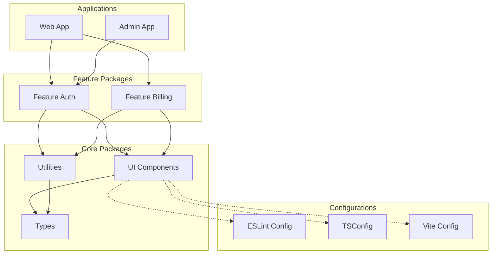

# Monorepo Patterns for Large-Scale Projects

Best practices for managing 140+ packages using Turborepo and Vite, based on real-world experience scaling enterprise monorepos.

---

## Table of Contents

1. [Repository Structure](#repository-structure)
2. [Turborepo Configuration](#turborepo-configuration)
3. [Package Organization](#package-organization)
4. [Dependency Management](#dependency-management)
5. [Build Optimization](#build-optimization)
6. [Vite Integration](#vite-integration)
7. [CI/CD Pipeline Patterns](#cicd-pipeline-patterns)
8. [Common Pitfalls](#common-pitfalls)

---

## Repository Structure

### Recommended Directory Layout

```
monorepo/
├── apps/                    # Deployable applications
│   ├── web/                 # Main web application
│   ├── admin/               # Admin dashboard
│   ├── mobile-web/          # Mobile-optimized PWA
│   └── docs/                # Documentation site
├── packages/                # Shared packages
│   ├── ui/                  # Design system components
│   ├── config/              # Shared configurations
│   │   ├── eslint-config/
│   │   ├── tsconfig/
│   │   └── vite-config/
│   ├── utils/               # Utility functions
│   ├── api-client/          # API client library
│   └── types/               # Shared TypeScript types
├── services/                # Backend services (if applicable)
│   ├── api/
│   ├── worker/
│   └── scheduler/
├── tools/                   # Internal tooling
│   ├── generators/          # Code generators
│   └── scripts/             # Build/deploy scripts
├── turbo.json               # Turborepo configuration
├── pnpm-workspace.yaml      # Workspace definition
└── package.json             # Root package.json
```

### Naming Conventions

```
@org/feature-domain-type

Examples:
@acme/ui-button           # UI component
@acme/utils-date          # Utility package
@acme/api-client-rest     # API client
@acme/config-eslint       # Configuration
```

---

## Turborepo Configuration

### Basic turbo.json

```json
{
  "$schema": "https://turbo.build/schema.json",
  "globalDependencies": [
    ".env",
    ".env.local"
  ],
  "globalEnv": [
    "NODE_ENV",
    "CI"
  ],
  "tasks": {
    "build": {
      "dependsOn": ["^build"],
      "inputs": ["src/**", "package.json", "tsconfig.json"],
      "outputs": ["dist/**", ".next/**"],
      "cache": true
    },
    "dev": {
      "cache": false,
      "persistent": true
    },
    "lint": {
      "dependsOn": ["^build"],
      "inputs": ["src/**", "*.config.*"],
      "outputs": [],
      "cache": true
    },
    "test": {
      "dependsOn": ["^build"],
      "inputs": ["src/**", "tests/**", "*.config.*"],
      "outputs": ["coverage/**"],
      "cache": true
    },
    "typecheck": {
      "dependsOn": ["^build"],
      "inputs": ["src/**", "tsconfig.json"],
      "outputs": [],
      "cache": true
    }
  }
}
```

### Advanced: Task Pipelines with Filtering

```json
{
  "tasks": {
    "build": {
      "dependsOn": ["^build"],
      "outputs": ["dist/**"]
    },
    "build:production": {
      "dependsOn": ["^build:production", "test", "lint"],
      "outputs": ["dist/**"],
      "env": ["PRODUCTION_API_URL"]
    },
    "deploy": {
      "dependsOn": ["build:production"],
      "cache": false
    }
  }
}
```

---

## Package Organization

### Package Categories (140+ Package Strategy)

| Category | Count | Purpose | Example |
|----------|-------|---------|---------|
| **UI Components** | 40-60 | Design system | `@org/ui-button`, `@org/ui-modal` |
| **Feature Modules** | 30-40 | Business logic | `@org/feature-auth`, `@org/feature-billing` |
| **Utilities** | 20-30 | Shared helpers | `@org/utils-date`, `@org/utils-validation` |
| **Configurations** | 10-15 | Shared configs | `@org/config-eslint`, `@org/config-tsconfig` |
| **API/Data** | 15-20 | Data layer | `@org/api-client`, `@org/data-models` |
| **Applications** | 5-10 | Deployables | `@org/app-web`, `@org/app-admin` |

### Package Template Structure

```
packages/ui-button/
├── src/
│   ├── index.ts           # Public exports
│   ├── Button.tsx         # Main component
│   ├── Button.test.tsx    # Tests
│   └── Button.css         # Styles
├── package.json
├── tsconfig.json
├── vite.config.ts
└── README.md
```

### Minimal package.json

```json
{
  "name": "@org/ui-button",
  "version": "1.0.0",
  "type": "module",
  "main": "./dist/index.js",
  "module": "./dist/index.js",
  "types": "./dist/index.d.ts",
  "exports": {
    ".": {
      "types": "./dist/index.d.ts",
      "import": "./dist/index.js"
    },
    "./styles.css": "./dist/styles.css"
  },
  "files": ["dist"],
  "scripts": {
    "build": "vite build",
    "dev": "vite build --watch",
    "typecheck": "tsc --noEmit"
  },
  "peerDependencies": {
    "react": "^18.0.0"
  },
  "devDependencies": {
    "@org/config-vite": "workspace:*",
    "@org/config-tsconfig": "workspace:*"
  }
}
```

---

## Dependency Management

### pnpm Workspace Configuration

```yaml
# pnpm-workspace.yaml
packages:
  - 'apps/*'
  - 'packages/*'
  - 'packages/config/*'
  - 'services/*'
  - 'tools/*'
```

### Dependency Rules



### Dependency Constraints

1. **Apps** can depend on anything
2. **Features** can depend on Core packages only
3. **Core** packages can only depend on other Core packages
4. **Config** packages have no internal dependencies

### Enforce with `depcheck` or Custom Linting

```javascript
// tools/scripts/check-deps.js
const ALLOWED_DEPS = {
  'packages/ui-*': ['@org/types', '@org/utils-*'],
  'packages/feature-*': ['@org/ui-*', '@org/utils-*', '@org/types'],
  'apps/*': ['*'], // Apps can use anything
};
```

---

## Build Optimization

### Remote Caching with Turborepo

```bash
# Enable remote caching (Vercel)
npx turbo login
npx turbo link

# Or self-hosted
TURBO_API=https://cache.yourcompany.com
TURBO_TOKEN=your-token
TURBO_TEAM=your-team
```

### Filtering for Faster Builds

```bash
# Build only affected packages
turbo build --filter=...[origin/main]

# Build specific package and dependencies
turbo build --filter=@org/app-web...

# Build dependents of a changed package
turbo build --filter=...@org/ui-button

# Parallel execution with concurrency limit
turbo build --concurrency=10
```

### Cache Hit Optimization

```json
{
  "tasks": {
    "build": {
      "inputs": [
        "src/**/*.{ts,tsx}",
        "!src/**/*.test.{ts,tsx}",
        "!src/**/*.stories.{ts,tsx}",
        "package.json",
        "tsconfig.json",
        "vite.config.ts"
      ],
      "outputs": ["dist/**"]
    }
  }
}
```

---

## Vite Integration

### Shared Vite Configuration Package

```typescript
// packages/config-vite/src/library.ts
import { defineConfig } from 'vite';
import react from '@vitejs/plugin-react';
import dts from 'vite-plugin-dts';
import { resolve } from 'path';

export function createLibraryConfig(options: {
  entry?: string;
  name?: string;
}) {
  return defineConfig({
    plugins: [
      react(),
      dts({
        include: ['src'],
        rollupTypes: true,
      }),
    ],
    build: {
      lib: {
        entry: resolve(process.cwd(), options.entry ?? 'src/index.ts'),
        formats: ['es'],
        fileName: 'index',
      },
      rollupOptions: {
        external: ['react', 'react-dom', 'react/jsx-runtime'],
      },
      sourcemap: true,
      minify: false, // Let apps handle minification
    },
  });
}
```

### Using Shared Config in Packages

```typescript
// packages/ui-button/vite.config.ts
import { createLibraryConfig } from '@org/config-vite/library';

export default createLibraryConfig({
  entry: 'src/index.ts',
});
```

### Application Vite Configuration

```typescript
// apps/web/vite.config.ts
import { defineConfig } from 'vite';
import react from '@vitejs/plugin-react';
import tsconfigPaths from 'vite-tsconfig-paths';

export default defineConfig({
  plugins: [react(), tsconfigPaths()],
  
  // Optimize dependencies from workspace
  optimizeDeps: {
    include: [
      '@org/ui-button',
      '@org/ui-modal',
      // Pre-bundle workspace packages for faster dev
    ],
  },
  
  build: {
    rollupOptions: {
      output: {
        manualChunks: {
          'vendor-react': ['react', 'react-dom'],
          'vendor-ui': ['@org/ui-button', '@org/ui-modal'],
        },
      },
    },
  },
});
```

---

## CI/CD Pipeline Patterns

### GitHub Actions with Turborepo

```yaml
# .github/workflows/ci.yml
name: CI

on:
  push:
    branches: [main]
  pull_request:
    branches: [main]

env:
  TURBO_TOKEN: ${{ secrets.TURBO_TOKEN }}
  TURBO_TEAM: ${{ vars.TURBO_TEAM }}

jobs:
  build:
    runs-on: ubuntu-latest
    steps:
      - uses: actions/checkout@v4
        with:
          fetch-depth: 2  # Needed for change detection

      - uses: pnpm/action-setup@v2
        with:
          version: 8

      - uses: actions/setup-node@v4
        with:
          node-version: 20
          cache: 'pnpm'

      - run: pnpm install --frozen-lockfile

      # Run only affected tasks
      - name: Build
        run: pnpm turbo build --filter=...[HEAD^1]

      - name: Lint
        run: pnpm turbo lint --filter=...[HEAD^1]

      - name: Test
        run: pnpm turbo test --filter=...[HEAD^1]
```

### Parallelized Deployment

```yaml
# .github/workflows/deploy.yml
name: Deploy

on:
  push:
    branches: [main]

jobs:
  detect-changes:
    runs-on: ubuntu-latest
    outputs:
      web: ${{ steps.changes.outputs.web }}
      admin: ${{ steps.changes.outputs.admin }}
    steps:
      - uses: actions/checkout@v4
      - uses: dorny/paths-filter@v2
        id: changes
        with:
          filters: |
            web:
              - 'apps/web/**'
              - 'packages/**'
            admin:
              - 'apps/admin/**'
              - 'packages/**'

  deploy-web:
    needs: detect-changes
    if: needs.detect-changes.outputs.web == 'true'
    runs-on: ubuntu-latest
    steps:
      - run: echo "Deploying web app..."

  deploy-admin:
    needs: detect-changes
    if: needs.detect-changes.outputs.admin == 'true'
    runs-on: ubuntu-latest
    steps:
      - run: echo "Deploying admin app..."
```

---

## Common Pitfalls

### ❌ Anti-Patterns to Avoid

| Anti-Pattern | Problem | Solution |
|--------------|---------|----------|
| **Circular dependencies** | Build failures, infinite loops | Use strict layer architecture |
| **Version mismatches** | Runtime errors | Use `workspace:*` protocol |
| **Over-granular packages** | Too much overhead | Group related functionality |
| **Shared mutable state** | Race conditions | Use immutable patterns |
| **Missing peer deps** | Duplicate bundles | Declare correctly |

### ✅ Solutions

#### Circular Dependency Detection

```bash
# Install madge for detecting cycles
pnpm add -D madge

# Check for circular dependencies
npx madge --circular --extensions ts,tsx packages/
```

#### Version Synchronization

```json
// package.json (root)
{
  "pnpm": {
    "overrides": {
      "react": "^18.2.0",
      "react-dom": "^18.2.0",
      "typescript": "^5.3.0"
    }
  }
}
```

#### Package Granularity Guide

```
TOO GRANULAR:              BETTER:
@org/utils-capitalize      @org/utils-string
@org/utils-lowercase       (contains capitalize, lowercase, etc.)
@org/utils-uppercase

TOO COARSE:                BETTER:
@org/everything            @org/ui-components
                           @org/utils
                           @org/api-client
```

---

## Performance Benchmarks

### Expected Build Times (140+ packages)

| Scenario | Cold Build | Cached Build |
|----------|------------|--------------|
| Full build (all packages) | 8-12 min | 30-60 sec |
| Single package change | 2-3 min | 10-20 sec |
| Config change (affects all) | 8-12 min | 8-12 min |

### Optimization Checklist

- [ ] Remote caching enabled
- [ ] Proper `inputs` defined in turbo.json
- [ ] Dependency graph is acyclic
- [ ] Using `workspace:*` for internal deps
- [ ] Build outputs are cacheable
- [ ] CI uses `--filter` for affected packages
- [ ] Dev server uses pre-bundled deps

---

## Quick Reference Commands

```bash
# Development
pnpm dev                              # Start all dev servers
pnpm dev --filter=@org/app-web        # Start specific app
pnpm dev --filter=./apps/*            # Start all apps

# Building
pnpm build                            # Build everything
pnpm build --filter=@org/app-web...   # Build app and deps
pnpm build --filter=...[main]         # Build affected since main

# Testing
pnpm test                             # Test everything
pnpm test --filter=@org/ui-*          # Test UI packages

# Maintenance
pnpm dlx turbo daemon status          # Check turbo daemon
pnpm store prune                      # Clean pnpm store
turbo prune --scope=@org/app-web      # Create minimal install
```

---

*Last updated: February 2026*
