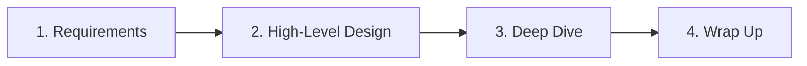
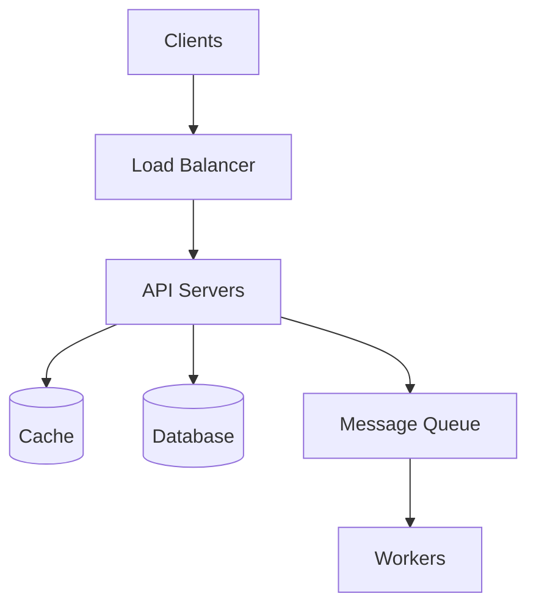
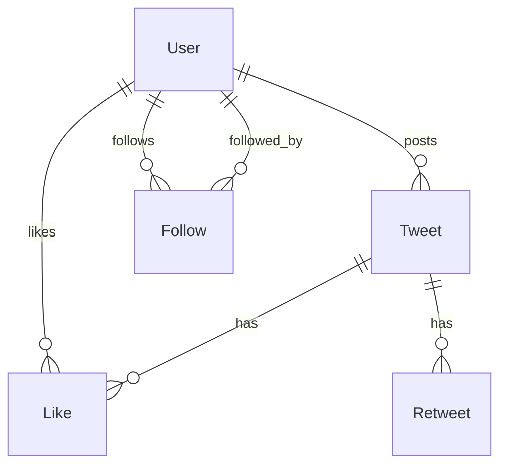
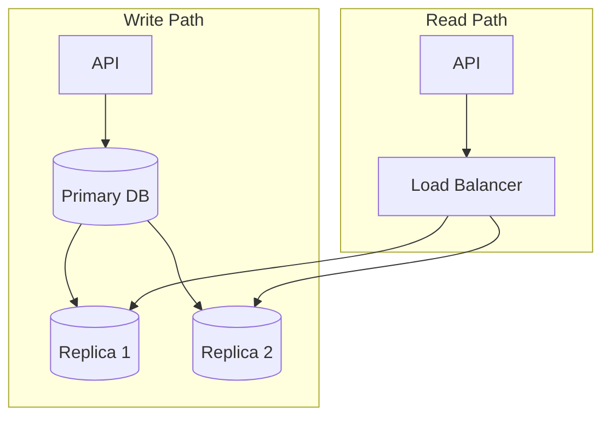
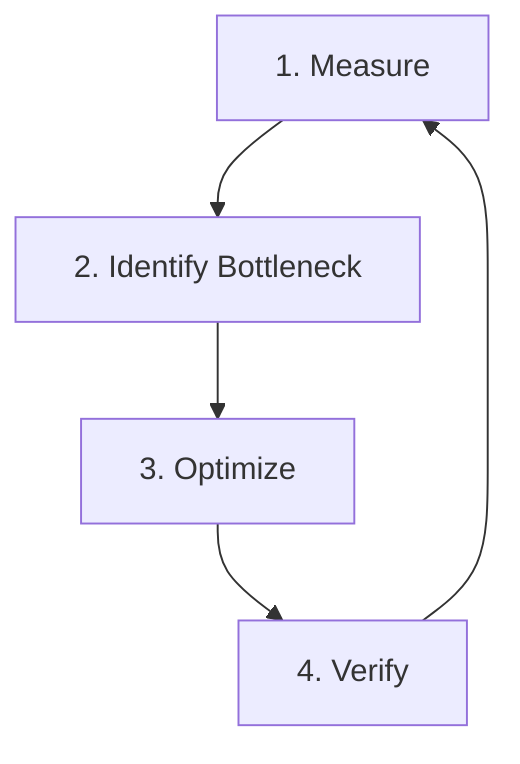
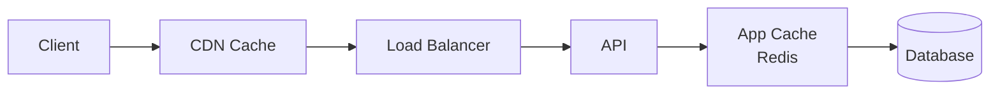
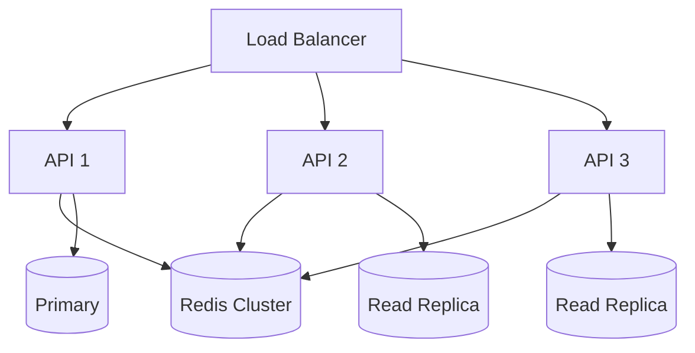
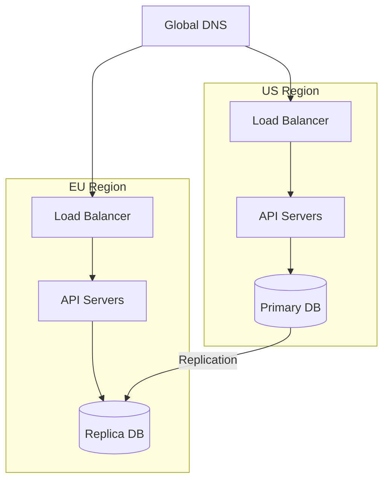

# System Design Workflows

Step-by-step processes for designing scalable systems.

---

## Table of Contents

1. [Design Interview Framework](#design-interview-framework)
2. [Capacity Planning](#capacity-planning)
3. [Database Design Workflow](#database-design-workflow)
4. [API Design Process](#api-design-process)
5. [Performance Optimization](#performance-optimization)
6. [Scalability Patterns](#scalability-patterns)

---

## Design Interview Framework

### The 4-Step Process



### Step 1: Requirements Clarification (5 min)

**Functional Requirements**
- What are the core features?
- Who are the users?
- What's the expected user journey?

**Non-Functional Requirements**
- Scale: DAU, QPS, data volume
- Latency: p50, p99 requirements
- Availability: SLA targets (99.9%, 99.99%)
- Consistency: Strong vs eventual

**Template Questions**
```markdown
1. What's the expected scale?
   - Daily Active Users: ___
   - Peak QPS: ___
   - Data size: ___

2. What latency is acceptable?
   - Read latency: ___ms
   - Write latency: ___ms

3. What's more important?
   - [ ] Consistency over availability
   - [ ] Availability over consistency

4. Geographic distribution?
   - [ ] Single region
   - [ ] Multi-region
```

### Step 2: High-Level Design (15 min)



**Key Components to Address**
1. Client layer
2. Load balancing
3. API layer
4. Data layer
5. Async processing

### Step 3: Deep Dive (20 min)

Pick 2-3 components to detail:

| Component | Topics to Cover |
|-----------|----------------|
| **Database** | Schema, sharding, replication |
| **Cache** | Strategy, invalidation, consistency |
| **API** | Rate limiting, authentication, versioning |
| **Search** | Indexing, ranking, pagination |
| **Messaging** | Delivery guarantees, ordering |

### Step 4: Wrap Up (5 min)

- Summarize key decisions
- Discuss trade-offs
- Mention monitoring & alerting
- Suggest future improvements

---

## Capacity Planning

### Back-of-Envelope Calculations

#### Traffic Estimation

```
Given: 100M DAU

Assumptions:
- Each user makes 10 requests/day
- 20% of traffic in peak hour
- Peak hour = 4 hours

Calculations:
Total requests/day = 100M × 10 = 1B requests
Peak hour requests = 1B × 0.2 = 200M requests
Peak QPS = 200M / (4 × 3600) = 14,000 QPS
```

#### Storage Estimation

```
Given: 10M new posts/day, 1KB each, 5 year retention

Calculations:
Daily storage = 10M × 1KB = 10GB/day
Annual storage = 10GB × 365 = 3.65TB/year
5-year storage = 3.65TB × 5 = 18.25TB

With replication (3x) = 55TB
With indexes (+30%) = 72TB total
```

#### Bandwidth Estimation

```
Given: 14,000 QPS, 100KB average response

Calculations:
Bandwidth = 14,000 × 100KB = 1.4GB/s = 11.2 Gbps

Recommended: 15-20 Gbps capacity (headroom)
```

### Capacity Planning Template

| Metric | Current | 6 Months | 1 Year | 3 Years |
|--------|---------|----------|--------|---------|
| DAU | | | | |
| Peak QPS | | | | |
| Storage | | | | |
| Bandwidth | | | | |
| Servers | | | | |

---

## Database Design Workflow

### Step 1: Identify Entities

```
User Story: "Users can post tweets and follow other users"

Entities:
- User
- Tweet
- Follow relationship
- Like
- Retweet
```

### Step 2: Define Relationships



### Step 3: Create Schema (DBML)

```dbml
Table users {
  id uuid [pk]
  username varchar(50) [unique, not null]
  email varchar(255) [unique, not null]
  display_name varchar(100)
  bio text
  avatar_url text
  created_at timestamp [default: `now()`]
  updated_at timestamp
  
  indexes {
    username [unique]
    email [unique]
  }
}

Table tweets {
  id uuid [pk]
  user_id uuid [ref: > users.id, not null]
  content text [not null]
  media_urls text[]
  reply_to_id uuid [ref: > tweets.id]
  retweet_of_id uuid [ref: > tweets.id]
  like_count int [default: 0]
  retweet_count int [default: 0]
  reply_count int [default: 0]
  created_at timestamp [default: `now()`]
  
  indexes {
    user_id
    created_at
    (user_id, created_at) [name: 'idx_user_timeline']
  }
}

Table follows {
  id uuid [pk]
  follower_id uuid [ref: > users.id, not null]
  following_id uuid [ref: > users.id, not null]
  created_at timestamp [default: `now()`]
  
  indexes {
    (follower_id, following_id) [unique]
    follower_id
    following_id
  }
}

Table likes {
  id uuid [pk]
  user_id uuid [ref: > users.id, not null]
  tweet_id uuid [ref: > tweets.id, not null]
  created_at timestamp [default: `now()`]
  
  indexes {
    (user_id, tweet_id) [unique]
    tweet_id
  }
}
```

### Step 4: Consider Access Patterns

| Query | Frequency | Optimization |
|-------|-----------|--------------|
| Get user timeline | Very High | Index on (user_id, created_at) |
| Get home feed | Very High | Pre-computed, cached |
| Get user profile | High | Cached |
| Like tweet | High | Counter cache |
| Follow user | Medium | Async fan-out |

### Step 5: Plan for Scale



---

## API Design Process

### REST Design Workflow

#### 1. Define Resources

```
Resources:
- /users
- /users/{id}
- /users/{id}/tweets
- /tweets
- /tweets/{id}
- /tweets/{id}/likes
```

#### 2. Define Operations

| Endpoint | Method | Description |
|----------|--------|-------------|
| /users | POST | Create user |
| /users/{id} | GET | Get user |
| /users/{id} | PATCH | Update user |
| /users/{id}/tweets | GET | Get user tweets |
| /tweets | POST | Create tweet |
| /tweets/{id} | GET | Get tweet |
| /tweets/{id} | DELETE | Delete tweet |
| /tweets/{id}/likes | POST | Like tweet |
| /tweets/{id}/likes | DELETE | Unlike tweet |

#### 3. Design Request/Response

```typescript
// POST /tweets
interface CreateTweetRequest {
  content: string;
  media_urls?: string[];
  reply_to_id?: string;
}

interface TweetResponse {
  id: string;
  content: string;
  user: {
    id: string;
    username: string;
    display_name: string;
    avatar_url: string;
  };
  media_urls: string[];
  like_count: number;
  retweet_count: number;
  reply_count: number;
  created_at: string;
  liked_by_me: boolean;
  retweeted_by_me: boolean;
}

// GET /users/{id}/tweets?cursor=xxx&limit=20
interface PaginatedResponse<T> {
  data: T[];
  pagination: {
    next_cursor: string | null;
    has_more: boolean;
  };
}
```

#### 4. Error Handling

```typescript
interface ErrorResponse {
  error: {
    code: string;
    message: string;
    details?: Record<string, unknown>;
  };
}

// Standard error codes
// 400: bad_request
// 401: unauthorized
// 403: forbidden
// 404: not_found
// 409: conflict
// 422: validation_error
// 429: rate_limit_exceeded
// 500: internal_error
```

---

## Performance Optimization

### Optimization Workflow



### Common Bottlenecks & Solutions

| Bottleneck | Symptom | Solution |
|------------|---------|----------|
| **Database** | Slow queries, high CPU | Indexes, query optimization, caching |
| **N+1 Queries** | Many small queries | Eager loading, DataLoader |
| **Large Payloads** | High bandwidth, slow responses | Pagination, field selection, compression |
| **No Caching** | Repeated expensive operations | Redis, CDN, HTTP caching |
| **Sync Processing** | Timeout on heavy operations | Message queues, background jobs |

### Caching Strategy



| Layer | TTL | Use Case |
|-------|-----|----------|
| **CDN** | 1 hour | Static assets, public content |
| **HTTP Cache** | 5 min | API responses with Cache-Control |
| **Application** | 1-60 min | User sessions, computed data |
| **Database** | Query-level | Query result caching |

### Monitoring Checklist

- [ ] APM (Application Performance Monitoring)
- [ ] Database query analysis
- [ ] Cache hit/miss ratios
- [ ] Error rates by endpoint
- [ ] P50, P95, P99 latencies
- [ ] Resource utilization (CPU, memory, I/O)

---

## Scalability Patterns

### Horizontal Scaling



### Database Sharding

```typescript
// Sharding function
function getShardId(userId: string, shardCount: number): number {
  const hash = hashFunction(userId);
  return hash % shardCount;
}

// Shard routing
class ShardRouter {
  private shards: Database[];
  
  getConnection(userId: string): Database {
    const shardId = getShardId(userId, this.shards.length);
    return this.shards[shardId];
  }
}
```

### Multi-Region Architecture



### Scalability Checklist

- [ ] Stateless application servers
- [ ] Externalized session storage
- [ ] Read replicas for database
- [ ] CDN for static content
- [ ] Message queues for async processing
- [ ] Auto-scaling policies defined
- [ ] Database connection pooling
- [ ] Circuit breakers for dependencies

---

*Last updated: February 2026*
