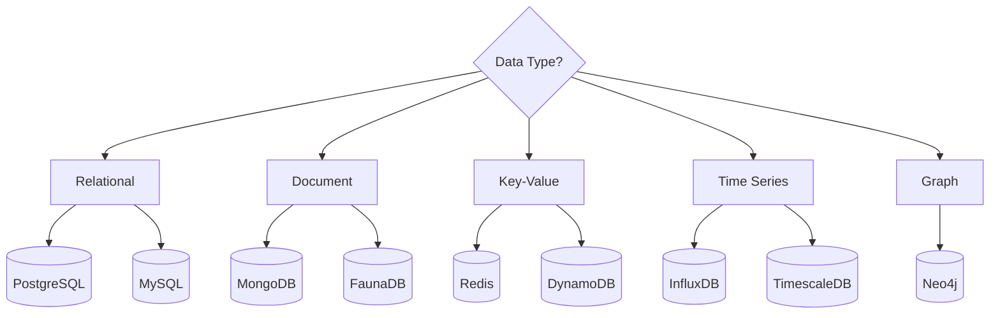
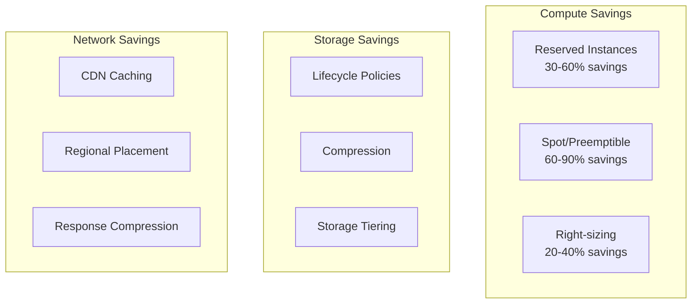

# Tech Decision Guide

Technical reference for technology stack decisions, security, and platform selection.

---

## Table of Contents

1. [Technology Stack Selection](#technology-stack-selection)
2. [Security Considerations](#security-considerations)
3. [Cloud Platform Comparison](#cloud-platform-comparison)
4. [Database Selection](#database-selection)
5. [Troubleshooting Guide](#troubleshooting-guide)

---

## Technology Stack Selection

### Frontend Stack

| Use Case | Recommended Stack | Notes |
|----------|------------------|-------|
| **Marketing Site** | Next.js + Tailwind | SSG, great SEO |
| **Dashboard/SPA** | React + Vite + TanStack Query | Fast dev, great DX |
| **E-commerce** | Next.js + Commerce.js | Built-in optimizations |
| **Mobile App** | React Native or Flutter | Cross-platform |
| **Admin Panel** | Refine or Tremor | Pre-built components |

### Backend Stack

| Use Case | Recommended Stack | Notes |
|----------|------------------|-------|
| **REST API** | Node.js + Express/Fastify | Simple, familiar |
| **GraphQL** | Node.js + GraphQL Yoga | Flexible queries |
| **Real-time** | Node.js + Socket.io | WebSocket support |
| **High Performance** | Go + Fiber | Low latency |
| **Enterprise** | NestJS + TypeORM | Full-featured |
| **Serverless** | AWS Lambda + API Gateway | Pay-per-use |

### Database Selection Matrix



### Full Stack Recommendations

#### Startup / MVP

```
Frontend: Next.js 14 + Tailwind CSS
Backend:  Next.js API Routes
Database: PostgreSQL (Neon/Supabase)
Auth:     NextAuth.js
Hosting:  Vercel
Payments: Stripe
```

#### Scale-up / Growth

```
Frontend: Next.js 14 + Tailwind CSS
Backend:  Node.js + Fastify
Database: PostgreSQL + Redis
ORM:      Drizzle ORM / Prisma
Queue:    BullMQ + Redis
Auth:     Auth0 / Clerk
Hosting:  AWS / GCP
Payments: Stripe
```

#### Enterprise

```
Frontend: React + Vite
Backend:  NestJS + GraphQL
Database: PostgreSQL + Elasticsearch
ORM:      TypeORM
Queue:    Apache Kafka
Auth:     Okta / Azure AD
Infra:    Kubernetes
Observability: Datadog / New Relic
```

---

## Security Considerations

### OWASP Top 10 Mitigations

| Risk | Mitigation | Implementation |
|------|------------|----------------|
| **Injection** | Parameterized queries | Use ORM, never concat SQL |
| **Broken Auth** | Strong session management | JWT rotation, secure cookies |
| **Sensitive Data** | Encryption at rest/transit | TLS 1.3, AES-256 |
| **XXE** | Disable XML external entities | Use JSON APIs |
| **Broken Access** | RBAC, validate all endpoints | Middleware checks |
| **Misconfig** | Security headers, defaults | Helmet.js, CSP |
| **XSS** | Output encoding, CSP | React auto-escapes |
| **Insecure Deserialization** | Input validation | Zod schemas |
| **Vulnerable Components** | Dependency scanning | Dependabot, Snyk |
| **Logging** | Audit logs, monitoring | Structured logging |

### Security Headers

```typescript
// Express/Fastify with Helmet
import helmet from 'helmet';

app.use(helmet({
  contentSecurityPolicy: {
    directives: {
      defaultSrc: ["'self'"],
      styleSrc: ["'self'", "'unsafe-inline'"],
      scriptSrc: ["'self'"],
      imgSrc: ["'self'", "data:", "https:"],
      connectSrc: ["'self'", "https://api.example.com"],
    },
  },
  hsts: {
    maxAge: 31536000,
    includeSubDomains: true,
    preload: true,
  },
}));
```

### Authentication Best Practices

```typescript
// JWT with rotation
interface TokenConfig {
  accessTokenExpiry: '15m';
  refreshTokenExpiry: '7d';
  algorithm: 'RS256';  // Use asymmetric for microservices
}

// Password hashing
import { hash, verify } from '@node-rs/argon2';

const hashedPassword = await hash(password, {
  memoryCost: 65536,
  timeCost: 3,
  parallelism: 4,
});

// Rate limiting
import rateLimit from 'express-rate-limit';

const authLimiter = rateLimit({
  windowMs: 15 * 60 * 1000, // 15 minutes
  max: 5, // 5 attempts
  message: 'Too many login attempts',
});
```

### Security Checklist

- [ ] HTTPS everywhere (TLS 1.3)
- [ ] Security headers configured
- [ ] Input validation on all endpoints
- [ ] Output encoding for XSS prevention
- [ ] Parameterized queries for SQL
- [ ] Password hashing with Argon2/bcrypt
- [ ] JWT with short expiry + refresh tokens
- [ ] Rate limiting on auth endpoints
- [ ] CORS properly configured
- [ ] Secrets in environment variables
- [ ] Dependency vulnerability scanning
- [ ] Security audit logging

---

## Cloud Platform Comparison

### Provider Overview

| Feature | AWS | GCP | Azure | Vercel |
|---------|-----|-----|-------|--------|
| **Compute** | EC2, Lambda, ECS | GCE, Cloud Run, GKE | VMs, Functions, AKS | Edge Functions |
| **Database** | RDS, DynamoDB | Cloud SQL, Firestore | SQL DB, Cosmos DB | - |
| **Storage** | S3 | Cloud Storage | Blob Storage | - |
| **CDN** | CloudFront | Cloud CDN | Azure CDN | Edge Network |
| **Kubernetes** | EKS | GKE | AKS | - |
| **Serverless** | Lambda | Cloud Functions | Functions | Edge Functions |
| **Best For** | Enterprise, full control | ML/AI, Kubernetes | Microsoft shops | Frontend/JAMstack |

### Cost Optimization



### Platform Selection Guide

| Scenario | Recommendation |
|----------|----------------|
| **Startup, fast iteration** | Vercel + Neon/Supabase |
| **Enterprise, existing AWS** | AWS all-in |
| **ML/AI heavy** | GCP (Vertex AI) |
| **Microsoft ecosystem** | Azure |
| **Kubernetes-first** | GKE or EKS |
| **Cost-sensitive** | DigitalOcean, Render |
| **Static sites** | Cloudflare Pages |

---

## Database Selection

### Decision Matrix

| Requirement | PostgreSQL | MySQL | MongoDB | Redis | DynamoDB |
|-------------|-----------|-------|---------|-------|----------|
| **ACID Transactions** | ✅ Full | ✅ Full | ⚠️ Limited | ❌ | ⚠️ Limited |
| **JSON Support** | ✅ JSONB | ✅ JSON | ✅ Native | ✅ JSON | ✅ Native |
| **Full-text Search** | ✅ Built-in | ✅ Built-in | ✅ Built-in | ❌ | ❌ |
| **Geo-spatial** | ✅ PostGIS | ✅ Spatial | ✅ Built-in | ✅ GeoHash | ❌ |
| **Horizontal Scale** | ⚠️ Citus | ⚠️ Vitess | ✅ Native | ✅ Cluster | ✅ Native |
| **Managed Options** | RDS, Neon | RDS, PlanetScale | Atlas | ElastiCache | DynamoDB |

### PostgreSQL vs MySQL

| Aspect | PostgreSQL | MySQL |
|--------|-----------|-------|
| **Standards** | More SQL-compliant | Some deviations |
| **JSON** | Superior JSONB | Good JSON support |
| **Extensions** | Rich ecosystem | Limited |
| **Replication** | Logical, physical | Statement, row |
| **Performance** | Better for complex queries | Better for simple reads |
| **Best For** | Analytics, complex apps | Simple CRUD, WordPress |

### When to Use Each

```
PostgreSQL: 
- Complex queries, joins
- Data integrity critical
- JSONB needed
- Full-text search
- Geographic data

MongoDB:
- Flexible schema
- Document storage
- Rapid prototyping
- Content management
- Real-time analytics

Redis:
- Session storage
- Caching layer
- Real-time leaderboards
- Pub/sub messaging
- Rate limiting

DynamoDB:
- Unpredictable scale
- Simple access patterns
- Serverless apps
- MS latency required
```

---

## Troubleshooting Guide

### Common Issues & Solutions

#### High Database CPU

```sql
-- Find slow queries
SELECT 
  query,
  calls,
  mean_time,
  total_time
FROM pg_stat_statements
ORDER BY total_time DESC
LIMIT 10;

-- Check missing indexes
SELECT 
  schemaname,
  tablename,
  indexrelname,
  idx_scan,
  idx_tup_read
FROM pg_stat_user_indexes
WHERE idx_scan = 0;
```

**Solutions:**
1. Add missing indexes
2. Optimize slow queries
3. Add read replicas
4. Implement caching

#### Memory Leaks (Node.js)

```bash
# Generate heap snapshot
node --inspect app.js
# Open Chrome DevTools and take heap snapshots

# Use clinic.js
npx clinic doctor -- node app.js
```

**Common Causes:**
- Event listener accumulation
- Closure references
- Global variable growth
- Unclosed database connections

#### High Latency

```typescript
// Add timing middleware
app.use((req, res, next) => {
  const start = performance.now();
  res.on('finish', () => {
    const duration = performance.now() - start;
    console.log(`${req.method} ${req.path} - ${duration}ms`);
  });
  next();
});
```

**Debugging Steps:**
1. Check APM for bottlenecks
2. Profile database queries
3. Review cache hit rates
4. Check external API latencies
5. Analyze network hops

#### Container OOM Kills

```yaml
# Kubernetes resource limits
resources:
  requests:
    memory: "256Mi"
    cpu: "250m"
  limits:
    memory: "512Mi"
    cpu: "500m"
```

**Solutions:**
1. Increase memory limits
2. Optimize application memory
3. Add horizontal scaling
4. Review memory leaks

### Debugging Checklist

- [ ] Check application logs
- [ ] Review APM metrics
- [ ] Analyze database slow query log
- [ ] Check cache hit/miss rates
- [ ] Review resource utilization
- [ ] Check external service status
- [ ] Analyze network latency
- [ ] Review recent deployments

### Useful Commands

```bash
# Check Node.js memory
node --max-old-space-size=4096 app.js

# Profile startup time
node --cpu-prof --cpu-prof-interval=100 app.js

# Analyze bundle size
npx source-map-explorer dist/**/*.js

# Check postgres connections
SELECT count(*) FROM pg_stat_activity;

# Redis memory analysis
redis-cli INFO memory

# Docker resource usage
docker stats

# Kubernetes pod logs
kubectl logs -f deployment/api-server

# Network debugging
curl -w "@curl-format.txt" -o /dev/null -s "https://api.example.com"
```

---

*Last updated: February 2026*
